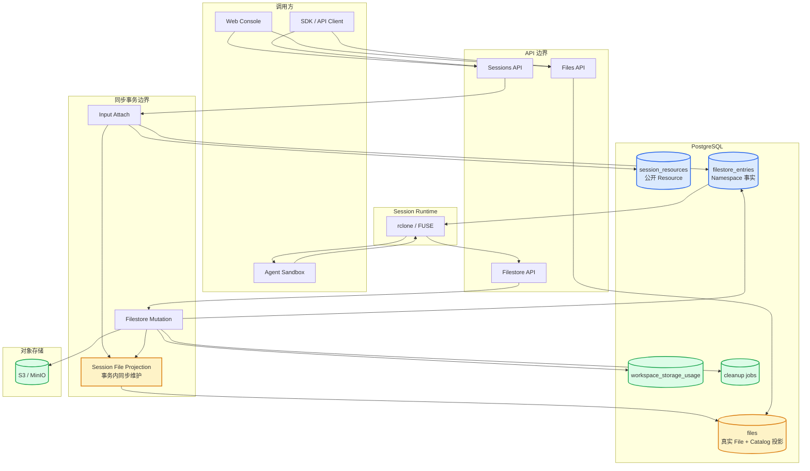
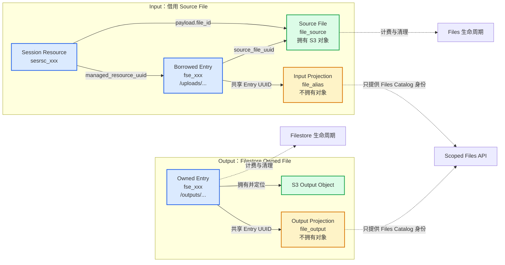
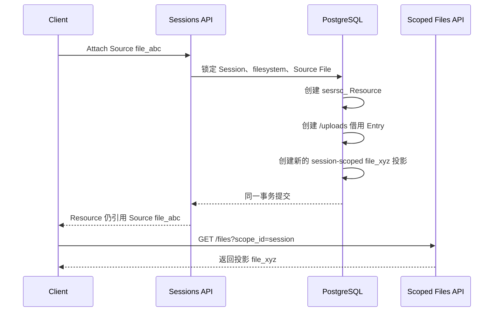
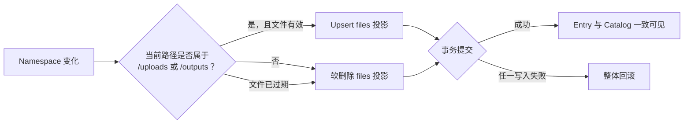
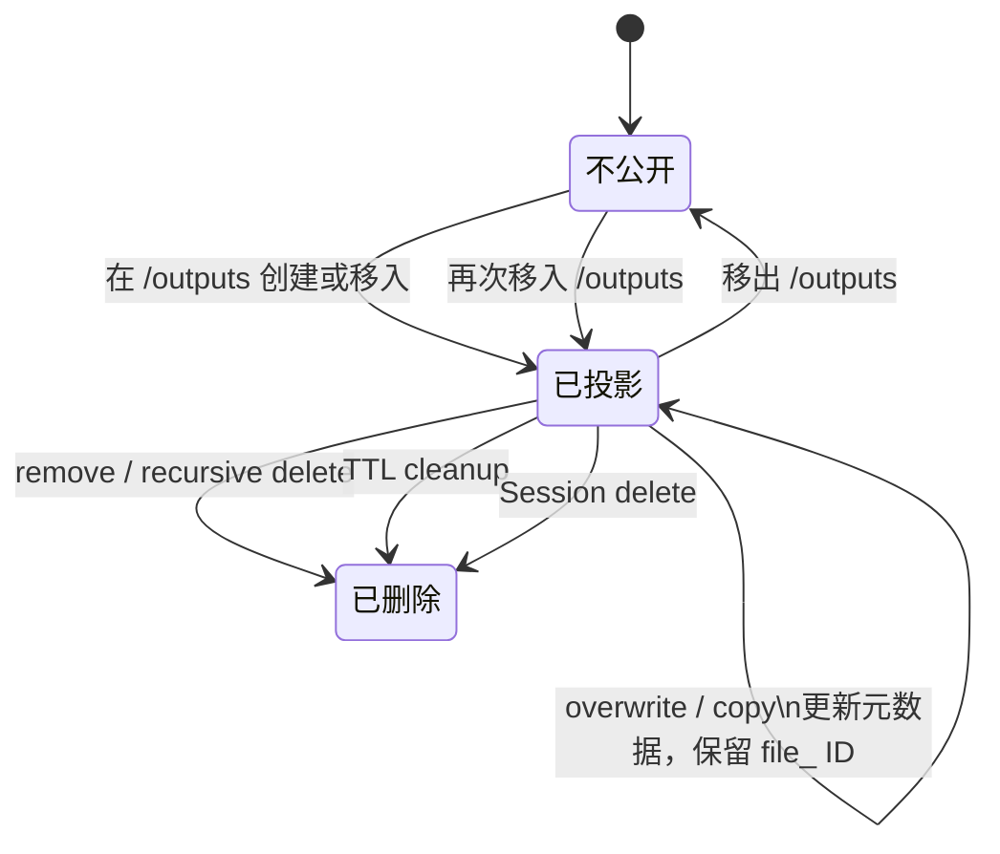

# PR #182：Session File Catalog Projection 工作总结

> 本文记录 PR #182 当时基于 `filestore_entries` 与 File projection 的历史实现，
> 不是统一后的现行设计。现行模型见 `docs/design/be/filestore.md`：Input 不再创建
> projection 或 Alias，而由 Session Resource 直接引用 Source File。

> PR：[feat: add session file catalog projection #182](https://github.com/superduck-ai/open-managed-agents/pull/182)
> 状态：已于 2026-07-28 合并
> 规模：30 个文件，约 `+2001/-132`

## 一句话总结

#182 没有统一 `filestore_entries` 与 `files`，而是在 `filestore_entries` 事实模型之上，为 Session 的 `/uploads` 输入和 `/outputs` 输出创建 `files` 投影，让 scoped Files API 能统一列出、读取和下载 Session 文件。

## 解决的问题

此前存在两套互不连通的读取路径：

- Sandbox/FUSE 通过 Filestore 操作 `filestore_entries`。
- `GET /v1/files?scope_id=<session_id>` 只查询 `files`。
- 已经挂载的输入和 Agent 写入的输出，无法从 scoped Files API 中看到。
- 控制台缺少上传文件及创建 Session File Resource 的完整入口。

## 组件架构



这张图体现了三个关键边界：

- Sandbox 文件系统以 `filestore_entries + S3` 为事实来源。
- scoped Files API 只读取 `files`。
- Projection 不是独立异步服务，而是 Attach 或 Filestore mutation 事务的一部分。

## 身份、引用与所有权



| 概念 | Input | Output |
|---|---|---|
| 对象所有者 | Source File | Filestore Entry |
| Session namespace | Borrowed Entry | Owned Entry |
| scoped Files 身份 | Input Projection | Output Projection |
| 配额承担者 | Source File | Owned Entry |
| 对象清理者 | Files 生命周期 | Filestore 生命周期 |

核心定位：

- `filestore_entries`：namespace、路径和对象生命周期的事实来源。
- `files` 投影：面向 Files API 的公开目录记录。
- 投影不拥有对象，不重复计费，也不能通过普通 Files delete 单独删除。

## Input attach

Input attach 会创建三类记录：

1. `session_resources`：保存公开 Resource 及 Source File ID。
2. 借用型 `filestore_entries`：挂载到 `/uploads/...`，引用 Source File UUID。
3. session-scoped `files` 投影：生成新的 `file_` ID，供 scoped Files API 使用。



重要语义：

- Source File 与 Session scoped File ID 不同。
- 同一个 Source File 可以多次 attach。
- 每次 attach 都有独立 Entry UUID 和独立 `file_` 投影 ID。
- 删除 Resource 只撤销借用 Entry 和投影，不删除 Source File。
- Source File 或投影存在活动引用时，普通 Files delete 返回冲突。
- Source File 的 `downloadable` 策略会被投影继承。

## 投影同步边界



最终同步策略：

- 不在 Files list 时修复投影。
- 不等待 Session 状态变化。
- 不使用异步 reconciliation。
- namespace 与 Catalog 要么一起提交，要么一起回滚。

## Output 生命周期

最终实现放弃了中间阶段的“Files 列表时刷新”，改为写事务内即时物化。



具体行为：

- `Put`、`Copy`、移动进入 `/outputs`：同事务 upsert 投影。
- overwrite：复用 Entry UUID，因此保留原投影 `file_` ID，仅更新对象元数据。
- 移出 `/outputs`、删除、递归删除、TTL 到期：同事务软删除投影。
- 投影写入失败：整个 Filestore mutation 回滚。
- Session 即使仍处于 `running` 或 `requires_action`，已提交输出也能立即通过 scoped Files API 读取。
- `/transcripts`、`/tool_results`、`/skills` 不进入公开 Files Catalog。

## 数据迁移

新增 migration：`00034_backfill_session_file_projections.sql`。

它只处理升级前已经存在的活动 Input Resource：

- 从借用 Entry 找到 Source File。
- 复用 Entry UUID 创建 session-scoped File 投影。
- 生成新的 `file_` external ID。
- 不修改存储配额。

它没有统一表结构，也没有删除旧数据模型；历史 Output 不在该迁移的回填范围内。

## 前端工作

控制台补齐了两条使用路径。

### Files 页面上传

- 支持多文件并发上传。
- 使用 `Promise.allSettled` 支持部分成功。
- 成功后返回第一页并刷新。
- 保留 Workspace Header。
- 提供成功与失败提示。

### Create Session File Resource

- File ID。
- `/uploads/...` 挂载路径。
- Sandbox 实际路径预览。
- Manage Files 链接。
- 多 Resource 添加和删除。
- 非法路径阻止提交。

路径转换：

```text
表单：    /uploads/reports/input.csv
API：     /reports/input.csv
Sandbox： /mnt/session/uploads/reports/input.csv
```

## 测试与加固

主要补充了以下覆盖：

- Input projection ID 独立且 workspace 隔离。
- Source File 删除保护与并发 attach/delete。
- 投影保持 Source 下载策略。
- Output 写入与投影的事务原子性。
- overwrite 保持稳定 `file_` ID。
- move in/out、remove、递归删除和 TTL 生命周期。
- 投影不重复计费、不重复清理对象。
- Session 删除即使 backing Entry 异常丢失，也能按 scope 清理投影。
- 前端上传成功、失败、部分成功和 Resource 表单校验。

PR 描述记录了全量 Go、前端测试、lint、死代码、重复代码、复杂度、pre-commit 和 Compose 配置检查。

## 对架构的实际影响

#182 的优点是保持 API 兼容，并以较小 schema 改动快速打通 scoped Files API；代价是引入了一套需要同步维护的投影：

- 文件元数据同时存在于 Entry 和投影 File。
- 每条写入、移动、删除、TTL 和 Session cleanup 路径都要维护投影。
- 每次 Filestore 文件写入增加一次 File upsert 或 soft-delete。
- Entry UUID 被用作跨表隐式关联。
- 配额重算必须显式排除投影。
- `files` 中同时混合真实文件和无所有权的目录投影。

因此，#182 更准确的定义是“Session File Catalog 投影”，不是“Session Resource、Filestore 与 File 的统一模型”。这也是后续 #184 希望消除的复杂度来源。
