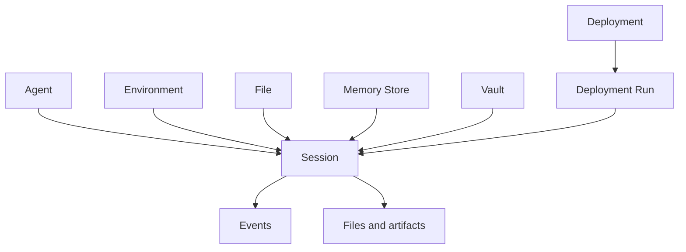

OMA 将智能体运行拆分为稳定定义、执行环境和有状态任务。拆分后的资源可以独立版本化、复用和审计。

## 智能体

智能体是可复用、可版本化的行为定义，通常包含：

- 模型和系统提示
- Tools 和 MCP 服务器
- 技能
- 多智能体协作配置
- 自定义 metadata

更新智能体会创建新版本。已存在的会话继续使用创建时保存的智能体快照，不会被后续修改静默改变。

## 环境

环境描述任务执行所在的隔离环境。它决定沙箱模板、依赖、网络策略和运行时能力。一个环境可以被多个会话复用。

## 会话

会话是一次有状态的智能体任务。它把智能体、环境、资源和凭证组合在一起，并保存：

- 当前状态和事件
- 线程
- 输入与输出资源
- token 使用量与统计数据
- 任务产物

客户端断开不会等同于删除会话。你可以再次读取会话、恢复事件流或继续发送事件。

## Resource

会话资源把外部上下文挂载到任务中。常见类型包括：

- File：上传到 OMA 对象存储的文件
- Git 仓库：代码仓库和 checkout 信息
- 记忆存储：可跨会话复用的记忆
- GitHub repository：代码仓库和 checkout 信息

资源的访问方式和可写性由资源类型及 `access` 配置决定。

## 密钥库

密钥库保存智能体运行需要的敏感凭证。会话通过密钥库 ID 引用凭证，而不是在请求体中重复传递密钥。

<Warning>
  密钥库只解决应用层密文存储与授权引用。生产环境仍需安全管理主 KEK、备份和轮换流程。
</Warning>

## 部署

部署把已验证的智能体工作流变成可重复运行的配置。它可以手动触发、暂停、恢复并产生部署运行。Webhook 可将会话和部署状态变化发送到外部系统。

## 资源关系

<Card title="创建第一个智能体" href="/docs/zh/api/agents/create-agent">
  查看智能体创建请求、字段和返回结构。
</Card>
