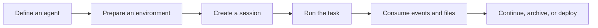

Open Managed Agents (OMA) is an open-source, self-hosted managed agents platform. It provides an Anthropic SDK-compatible `/v1` API, agent runtime orchestration, isolated environments, and a web console for long-running tasks.

<Note>
  OMA is evolving quickly. Beta requirements vary by resource. Follow the relevant API page and the behavior of the version you deploy.
</Note>

## What OMA solves

A traditional model call normally completes within one HTTP request. An agent task can run for minutes or longer and needs durable state, files, tools, an isolated environment, and a resumable event stream. OMA exposes those capabilities as composable resources.

<CardGroup cols={2}>
  <Card title="Durable tasks" icon="clock-rotate-left">
    Sessions run independently from a client connection. Reconnect later to read events and results.
  </Card>
  <Card title="Isolated execution" icon="box">
    Environments provide controlled sandbox boundaries for code, dependencies, and files.
  </Card>
  <Card title="Reusable agents" icon="robot">
    Agents version models, system prompts, tools, skills, and MCP servers as one definition.
  </Card>
  <Card title="A self-hosted control plane" icon="server">
    You control PostgreSQL, Redis, and S3-compatible storage for local or private deployments.
  </Card>
</CardGroup>

## Core workflow

1. Create an agent with a model, instructions, tools, and skills.
2. Create or select an environment with the required runtime.
3. Create a session that combines the agent, environment, files, memory stores, and vaults.
4. Follow progress through events and retrieve artifacts from session resources.
5. Use deployments and webhooks to automate validated workflows.

## Relationship to Claude Managed Agents

OMA takes inspiration from the Claude Managed Agents resource model and developer experience, while aiming for Anthropic SDK compatibility. Its operational model is different: you operate the service, database, object storage, sandbox infrastructure, and upstream model credentials.

| Capability | OMA |
| --- | --- |
| Deployment | Open source and self-hosted |
| API | Anthropic SDK-compatible `/v1` resources |
| Console | React web console |
| Metadata | PostgreSQL |
| Platform sessions | Redis |
| Files and artifacts | S3-compatible object storage |
| Sandboxes | E2B or local e2b-local |

<CardGroup cols={2}>
  <Card title="Quickstart" icon="rocket" href="/en/docs/quickstart">
    Start a complete local environment with Docker Compose.
  </Card>
  <Card title="API overview" icon="brackets-curly" href="/en/api/overview">
    Learn authentication, headers, pagination, and core resources.
  </Card>
</CardGroup>
