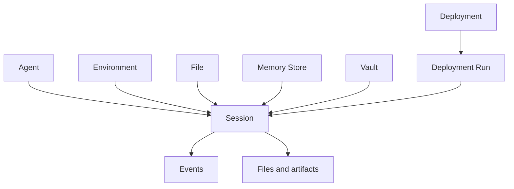

OMA 将 Agent 运行拆分为稳定定义、执行环境和有状态任务。拆分后的资源可以独立版本化、复用和审计。

## Agent

Agent 是可复用、可版本化的行为定义，通常包含：

- 模型和系统提示
- Tools 和 MCP Servers
- Skills
- 多 Agent 协作配置
- 自定义 metadata

更新 Agent 会创建新版本。已存在的 Session 继续使用创建时保存的 Agent 快照，不会被后续修改静默改变。

## Environment

Environment 描述任务执行所在的隔离环境。它决定 Sandbox 模板、依赖、网络策略和运行时能力。一个 Environment 可以被多个 Session 复用。

## Session

Session 是一次有状态的 Agent 任务。它把 Agent、Environment、资源和凭证组合在一起，并保存：

- 当前状态和事件
- Thread
- 输入与输出资源
- token 使用量与统计数据
- 任务产物

客户端断开不会等同于删除 Session。你可以再次读取 Session、恢复事件流或继续发送事件。

## Resource

Session Resource 把外部上下文挂载到任务中。常见类型包括：

- File：上传到 OMA 对象存储的文件
- Git repository：代码仓库和 checkout 信息
- Memory store：可跨 Session 复用的记忆
- URL：可访问的外部资料

资源的访问方式和可写性由资源类型及 `access` 配置决定。

## Vault

Vault 保存 Agent 运行需要的敏感凭证。Session 通过 Vault ID 引用凭证，而不是在请求体中重复传递密钥。

<Warning>
  Vault 只解决应用层密文存储与授权引用。生产环境仍需安全管理主 KEK、备份和轮换流程。
</Warning>

## Deployment

Deployment 把已验证的 Agent 工作流变成可重复运行的配置。它可以手动触发、暂停、恢复并产生 Deployment Run。Webhook 可将 Session 和 Deployment 状态变化发送到外部系统。

## 资源关系

<Card title="创建第一个 Agent" icon="robot" href="/zh/api/endpoints/create-agent">
  查看 Agent 创建请求、字段和返回结构。
</Card>
