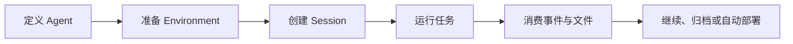

Open Managed Agents（OMA）是一个开源、自托管的 Managed Agents 平台。它提供兼容 Anthropic SDK 的 `/v1` API、Agent 运行时编排、隔离环境和 Web 控制台，让团队可以在自己的基础设施中运行长时间任务。

<Note>
  OMA 仍在快速演进。不同资源的 beta 要求可能不同，请以对应 API 页面和当前版本实现为准。
</Note>

## OMA 解决什么问题

传统的模型调用通常在一次 HTTP 请求内完成。Agent 任务则可能持续数分钟或更久，需要持久状态、文件、工具、隔离环境和可恢复的事件流。OMA 将这些能力组织为一组可组合资源。

<CardGroup cols={2}>
  <Card title="可持久化的任务" icon="clock-rotate-left">
    Session 独立于客户端连接运行。客户端可以稍后恢复事件流并查看结果。
  </Card>
  <Card title="隔离执行环境" icon="box">
    Environment 为代码、依赖和文件提供受控的 Sandbox 边界。
  </Card>
  <Card title="可复用的 Agent" icon="robot">
    Agent 将模型、系统提示、工具、Skills 和 MCP Server 固化为版本化定义。
  </Card>
  <Card title="自托管控制面" icon="server">
    PostgreSQL、Redis 和 S3 兼容存储都由你控制，适合本地开发和私有部署。
  </Card>
</CardGroup>

## 核心工作流

1. 创建一个 Agent，声明模型、提示词、工具和 Skills。
2. 创建或选择一个 Environment，提供 Agent 所需的运行环境。
3. 创建 Session，把 Agent、Environment、文件、Memory Store 和 Vault 组合起来。
4. 通过事件接口观察进度，并从 Session 资源中获取产物。
5. 使用 Deployment 和 Webhook 将验证后的工作流自动化。

## 与 Claude Managed Agents 的关系

OMA 参考 Claude Managed Agents 的资源模型和开发体验，并尽量保持 Anthropic SDK 兼容。OMA 的部署和运维语义不同：服务、数据库、对象存储、Sandbox 与上游模型凭证均由部署者负责。

| 能力 | OMA |
| --- | --- |
| 部署方式 | 开源、自托管 |
| API | 兼容 Anthropic SDK 的 `/v1` 资源接口 |
| 控制台 | React Web 控制台 |
| 元数据 | PostgreSQL |
| 会话状态 | Redis |
| 文件与产物 | S3 兼容对象存储 |
| Sandbox | E2B 或本地 e2b-local |

<CardGroup cols={2}>
  <Card title="快速开始" icon="rocket" href="/zh/docs/quickstart">
    使用 Docker Compose 启动完整的本地环境。
  </Card>
  <Card title="API 概览" icon="brackets-curly" href="/zh/api/overview">
    了解认证、请求头、分页和核心资源。
  </Card>
</CardGroup>
